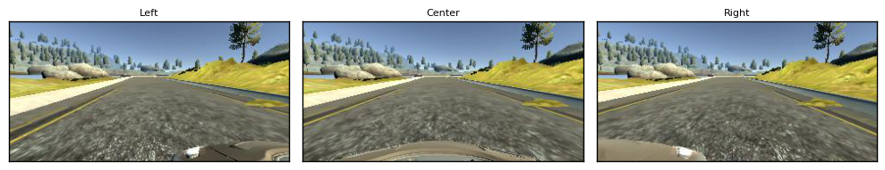
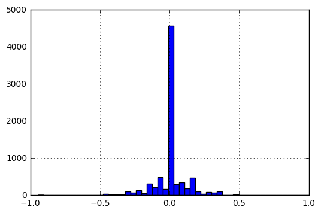
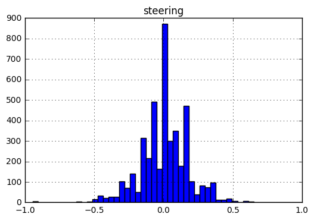
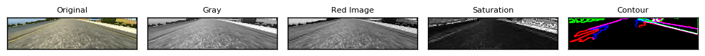
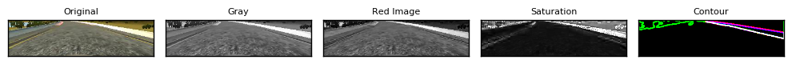
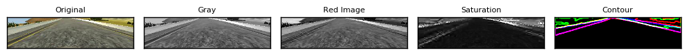
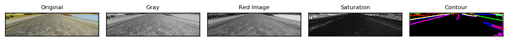
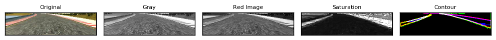

# Behavioral Cloning For Self Driving Cars

## About this project

This repository contains code for a project I did as a part of Udacity's Self Driving Car Nano Degree Program. Using a Simulator a model should be trained to provide the steering to drive a car in the simulator

## Exploring the Dataset
I used the dataset provided by Udacity. The set contains images of three cameras, each camera got 8036 images. I did record data by myself, but the disapointing results during the first exhausive tests let me move to the Udacity dataset. I expected comparable results related to fellow students project solutions. Explicitly named [wonjunee](https://github.com/wonjunee/behavioral-cloning) , [Subodh Malgonde](https://github.com/subodh-malgonde/behavioral-cloning) and [Vivek Yadav](https://chatbotslife.com/using-augmentation-to-mimic-human-driving-496b569760a9#.nt7vg21wm)

The dataset contains JPG images of dimensions 160x320x3. Here are some sample images from the dataset.

## Data Augmentation

As the Udacity (like own recorded data sets) is highly unbalance related to the steering value, I filtered out by random 85% of the zero steering time points. Pictures below show the distribution before and after the filter of zero steering. Initially the data set of 8036 records contained 3675 steering != 0 and 4361 steering == 0. 

After the filter the zero steering records dropped down to 654. The distributions is now more balanced.

I used the left and the right camera images but modified the steering by +/- 0.25 to support drive back on the center of the lane. This was recommended by the project tips and tricks and my test results confirmed that this leads to  more stable driving on the track. I played with the probability, which camera to be selected. Starting from equal probability for center left and right, I finally choosed a higher value for the center camera compared to left and right (3:1)

I choosed  the common technics to enrich the data by flipping images vertically (and flip the sign of the steering)  and randomly shift images horizontal and vertically to improve generalization of the trained network. Experiments did not show a significant improvement, nevertheless I kept it as an standard instrument to counter overfitting.

I did not change the steering when shifting the x value of an image, as to me, it only represents an alternative parallel path on the track. I expected a change on the steering in the direction against the shift would support a move back to the center area of the track, but experiments did not show an improvement.

During further testing I notified, that many of my trained networks got only problems in the left curve after the bridge. I augmented the Udacity data by own recordings for that curve only to guide the training.
This additional augmentation stabilized the results a lot. The curve was hit only in rare cases.

In total I used a sample size of 38720 images for training and 9600 for validation per each epoch.

## Data Preprocessing

In parallel to the Behavioral Cloning project, I worked already on the Advanced Line finding project.
This motivated me to use some more sophisticated computer vision preprocessing that extract features from the images.

I made exhaustive experiments to find an own solution that works and played a lot with different computer vision algorithms. Finally I found a good approach to extract significant information from the images with less clutter.

I expectated that feature extraction should help the deep learning network to focus on the relevant information. I choosed the following algorithm to extract features in the image:

- Each image has a size of 320x160x3. I extracted the center lower part of the image, as this contains the most relevant information about the position of the car on the track. On the bottom of the images the hood of the car is visible, this can be ignored as well. I cutted from the top 60 PIXEL and from the bottom 20. 
The remaining image got a size of 80x320 pixel.

- Instead of the RGB color channels, I used the Red, Gray and Saturation (HLS space) information as channels.

- Each channel was Gaussian blurred using kernel size 7.

- On the blurred images I applied Otsu’s binarization, which looks for the optimal threshold between two peaks using the histogram of an image.

- On the binary map of each channel I applied the contour finding algorithm (cv2.findContours). The algorithm compresses horizontal, vertical, and diagonal segments and leaves only their end points. Each contour is represent by a list of points.

- The list of contours ist filtered by the number of points belonging to a feature. I kept only features that had more than 100 points to supress clutter and to extract lines.

- The remaining features are drawn on a blank image. The low center area is wiped out to further remove clutter that are caused by the granular ground in the images.

The resulting image is a stack of three contour presentation of color space channels.
Finally the image is resized to 64x64x3.

The image shows the discribed different channels and the contour image.

## Data Generation
The data is augmented and generated on the fly using a keras python generator. Because of randomizing the selection of the three camera, flip of the image and the x/y shifts, I increased the sample size of each epoch by the factor of 10 related to the number of records in the data set. 

Nevertheless because of the random selection, each epoch is processed using different data set. This applies for training (80%) and validation (20%). 

## Solution Design

I studied the solutions of the Udacity challenge 2, the solutions of the above mentioned fellows, 
and the nvidia paper [nvidia paper](http://images.nvidia.com/content/tegra/automotive/images/2016/solutions/pdf/end-to-end-dl-using-px.pdf)

## Model Architecture
I used a model having three conv2D levels connected by max pooling and drop layer to reduce over fitting.
Details as below:

<table>
<thead><tr><th>Layer Number</th><th>Description</th></tr></thead>
<tr><td>Layer 1-4</td><td>Conv layer with 32 3x3 filters, RELU activation, 2x2 max pooling and dropout(0.15) </td></tr>
<tr><td>Layer 5-8</td><td>Conv layer with 32 3x3 filters, RELU activation, 2x2 max pooling and dropout(0.15) </td></tr>
<tr><td>Layer 9-12</td><td>Conv layer with 32 3x3 filters, RELU activation, 2x2 max pooling and dropout(0.15) </td></tr>
<tr><td>Layer 13-15</td><td>Fully connected layer with 1024 neurons, Dropout(0.15) and RELU activation</td></tr>
<tr><td>Layer 16-17</td><td>Fully connected layer with 512 neurons and RELU activation</td></tr>
<tr><td>Layer 18-19</td><td>Fully connected layer with 64 neurons and RELU activation</td></tr>
<tr><td>Layer 20</td><td>Output layer is one neuron</td></tr>
</table>

All layers are initiated by normalized weights.

## Training Method

Optimizer: nadam Optimizer. In tests that optimizer showed a more constant improvement of the val loss compared to the adam. The training got these parameters:

- No. of epochs: maximum of 16. Early stopping and save of the model weights after each epoch 
- Usually after 7 epoch the val loss increase constantly, which indicates overfitting
- Images generated per epoch: 38720 images generated on the fly
- Validation Set: 9600 images, generated on the fly
- Keras' fit_generator method is used to train and validate images generated by the generator

## Demo Video
Please click on the image to watch the video.

## Code

<table>
<thead><tr><th>File</th><th>Description</th></tr></thead>
<tr><td>model.py</td><td>the script to create and train the model. Parameters are define at line 97. Especially data_dir needs to be adapted to the local environment</td></tr>
<tr><td>drive.py</td><td>the script to drive the car. Command line paramter "model" has to be provided</td></tr>
<tr><td>preprocess.py</td><td>the script to do the preprocessing. It is called from drive and model scripts</td></tr>
<tr><td>README.MD</td><td>project documentation</td></tr>
<tr><td>model.json</td><td>the model configuration</td></tr>
<tr><td>model.h5</td><td>the model weights</td></tr>
</table>

#System Environment

Linux Ubuntu 14.04
GPU NVIDIA 1060 Driver Version: 367.48
Python 3.5 

