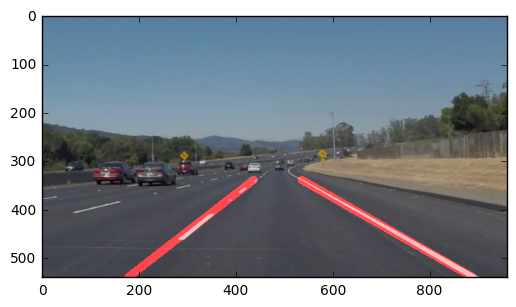
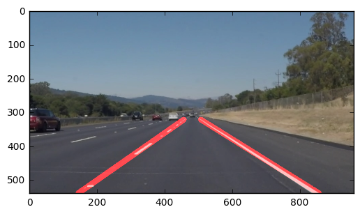
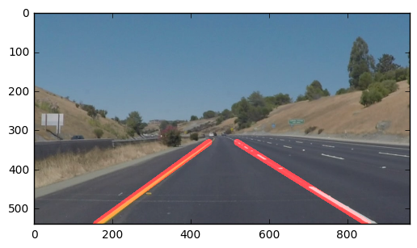
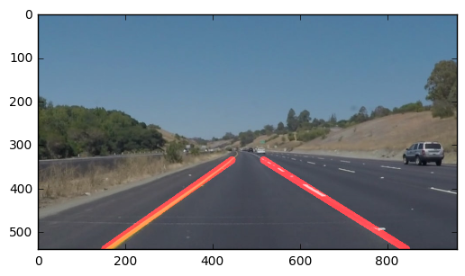
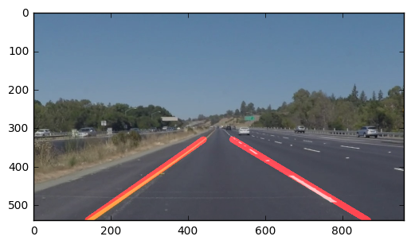
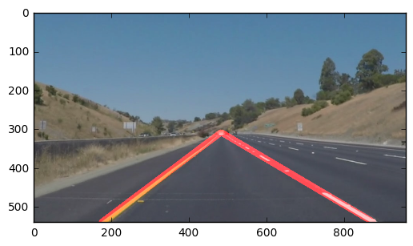

# **Finding Lane Lines on the Road** 
***
In this project, I used the cv2 tools to identify lane lines on the road.  I developed a pipeline on a series of individual images, and later applied the result to a video stream. 


```python
#importing some useful packages
import matplotlib.pyplot as plt
import matplotlib.image as mpimg
import numpy as np
import cv2
%matplotlib inline
```


```python
#reading in an image
image = mpimg.imread('test_images/solidWhiteRight.jpg')
#printing out some stats and plotting
print('This image is:', type(image), 'with dimesions:', image.shape)
plt.imshow(image)  #call as plt.imshow(gray, cmap='gray') to show a grayscaled image
```

    This image is: <class 'numpy.ndarray'> with dimesions: (540, 960, 3)


    <matplotlib.image.AxesImage at 0x7f1de4023550>


**Some OpenCV functions that have been useful for this project are:**

`cv2.inRange()` for color selection  
`cv2.fillPoly()` for regions selection  
`cv2.line()` to draw lines on an image given endpoints  
`cv2.addWeighted()` to coadd / overlay two images
`cv2.cvtColor()` to grayscale or change color
`cv2.imwrite()` to output images to file  
`cv2.bitwise_and()` to apply a mask to an image

Below are some helper functions I needed to get started.


```python
import math

def grayscale(img):
    """Applies the Grayscale transform
    This will return an image with only one color channel
    but NOTE: to see the returned image as grayscale
    you should call plt.imshow(gray, cmap='gray')"""
    return cv2.cvtColor(img, cv2.COLOR_BGR2GRAY)
    
def canny(img, low_threshold, high_threshold):
    """Applies the Canny transform"""
    return cv2.Canny(img, low_threshold, high_threshold)

def gaussian_blur(img, kernel_size):
    """Applies a Gaussian Noise kernel"""
    return cv2.GaussianBlur(img, (kernel_size, kernel_size), 0)

def region_of_interest(img, vertices):
    """
    Applies an image mask.
    
    Only keeps the region of the image defined by the polygon
    formed from `vertices`. The rest of the image is set to black.
    """
    #defining a blank mask to start with
    mask = np.zeros_like(img)   
    
    #defining a 3 channel or 1 channel color to fill the mask with depending on the input image
    if len(img.shape) > 2:
        channel_count = img.shape[2]  # i.e. 3 or 4 depending on your image
        ignore_mask_color = (255,) * channel_count
    else:
        ignore_mask_color = 255
        
    #filling pixels inside the polygon defined by "vertices" with the fill color    
    cv2.fillPoly(mask, vertices, ignore_mask_color)
    
    #returning the image only where mask pixels are nonzero
    masked_image = cv2.bitwise_and(img, mask)
    return masked_image


def draw_lines(img, lines, color=[255, 0, 0], thickness=4):
    """
    NOTE: this is the function you might want to use as a starting point once you want to 
    average/extrapolate the line segments you detect to map out the full
    extent of the lane (going from the result shown in raw-lines-example.mp4
    to that shown in P1_example.mp4).  
    
    Think about things like separating line segments by their 
    slope ((y2-y1)/(x2-x1)) to decide which segments are part of the left
    line vs. the right line.  Then, you can average the position of each of 
    the lines and extrapolate to the top and bottom of the lane.
    
    This function draws `lines` with `color` and `thickness`.    
    Lines are drawn on the image inplace (mutates the image).
    If you want to make the lines semi-transparent, think about combining
    this function with the weighted_img() function below
    """
    for line in lines:
        for x1,y1,x2,y2 in line:
            cv2.line(img, (x1, y1), (x2, y2), color, thickness)

def hough_lines(img, rho, theta, threshold, min_line_len, max_line_gap):
    """
    `img` should be the output of a Canny transform.
        
    Returns an image with hough lines drawn.
    """
    lines = cv2.HoughLinesP(img, rho, theta, threshold, np.array([]), minLineLength=min_line_len, maxLineGap=max_line_gap)
    line_img = np.zeros((*img.shape, 3), dtype=np.uint8)
    draw_lines(line_img, lines)
    return line_img

# Python 3 has support for cool math symbols.

def weighted_img(img, initial_img, α=0.8, β=1., λ=0.):
    """
    `img` is the output of the hough_lines(), An image with lines drawn on it.
    Should be a blank image (all black) with lines drawn on it.
    
    `initial_img` should be the image before any processing.
    
    The result image is computed as follows:
    
    initial_img * α + img * β + λ
    NOTE: initial_img and img must be the same shape!
    """
    return cv2.addWeighted(initial_img, α, img, β, λ)

def color_select(image,threshold_r,threshold_g,threshold_b):
# Use a "bitwise OR" to identify pixels below the threshold
  thresholds = (image[:,:,0] < threshold_r) \
            | (image[:,:,1] < threshold_g) \
            | (image[:,:,2] < threshold_b)
  filtered = image.copy()
  filtered[thresholds] = [0,0,0]
  return filtered


```

## Test on Images

Now define functions that I need in the pipeline to process the images


```python
from operator import itemgetter

#extract the lower center part of the image
def filterAreaOfInterest(image):
    maxx = image.shape[1]
    maxy = image.shape[0]
    y1 = int(maxy)
    y2 = int(maxy*0.58)
    x1 = int(maxx*0.4)
    x2 = int(maxx*0.6)
    x3 = int(maxx)
    area = np.array([[0,y1],[x1,y2],[x2,y2],[x3,y1]])
    
    return region_of_interest(image,[area])

#filter colors exeeding a statistical criteria
def filterImage(image):
    
  filtered_image = color_select(image,175,175,35)
  return filtered_image

#filter and average lines, add slope and offset
def averageLines(lines,max_delta_m, max_delta_b, max_delta_dist):
  av1_lines=[]
  av2_lines=[]
  for i in range(lines.shape[0]):
    for x1,y1,x2,y2 in lines[i]:
    
      if x2 -x1 == 0:
        continue
        
      #filter short lines
      l = (x2 -x1)*(x2 -x1) + (y2 - y1)*(y2 - y1)
      if l < 200:
        continue
    
      m1 = (y2 -y1) / (x2 -x1)
      if m1 == 0:
        m1 = 0.0001
        
      b1 = y1 - x1*m1
    
      #filter unrelistic angle to drive 
      if m1 > 0 and (m1 < 0.3 or  m1 > 2):
        continue
      elif m1 < 0 and (m1 > (-0.3) or  m1 < (-2)):
        continue
                     
      # sort coordinates
      if x2 > x1:
        av1_lines.append((m1,b1,x1,y1,x2,y2))  
      else:
        av1_lines.append((m1,b1,x2,y2,x1,y1))  
        
#loop over pairs of lines and collect similar ones to average        
  for i in range(len(av1_lines)):    
    (m1,b1,x11,y11,x12,y12) = av1_lines[i]
    if x11 == 0 and x12 == 0:
      continue
    av_lines=[]
    av_lines.append((m1,b1,x11,y11,x12,y12))  

    for j in range(len(av1_lines)-1, i, -1):
      (m2,b2,x21,y21,x22,y22) = av1_lines[j]
      if x21 == 0 and x22 == 0:
        continue
        
# distance between begin point and and point of two lines  
      dist = (x21 - x12)*(x21 - x12) + (y21 - y12)*(y21 - y12)
            
# apply average conditions
      if (abs(math.atan(m1) - math.atan(m2)) > max_delta_m) or (abs(b1 - b2) > max_delta_b) or dist > max_delta_dist:
        continue
        
      av_lines.append((m2,b2,x21,y21,x22,y22))  
# mark the line not to be used again  
      av1_lines[j] = (0,0,0,0,0,0)
#      print("merge ",j, " to ",i)

    if len(av_lines) > 1:
#mean for slope and offset
      av = np.mean(av_lines,axis=0)       
#min y for end of lane coordinate, 
      avmin = np.min(av_lines,axis=0)       
#max y for bottom line      
      avmax = np.max(av_lines,axis=0)       
      m = av[0]
      if m == 0:
        continue
        
      b = av[1]       

      x0 = avmin[2]        
      y0 = int(x0*m + b)      
    
      x1 = avmax[4]        
      y1 = int(x1*m + b)      
       
      av_line = (m,b,int(x0),int(y0),int(x1),int(y1))
      av2_lines.append(av_line)
    else:
      av2_lines.append(av_lines[0])    
    
  return av2_lines

#extend a line to the bottom ( max y value)
def extendToBottomTop(line, maxY, minY, centerX):
  (m,b,x1,y1,x2,y2) = line
#  print(line)
  yb = maxY
  xb = int((yb - b) / m)       

  yt = min(y1,y2)
  if minY > 0:
    yt = minY
    
  yt = minY
  xt = int((yt - b) / m)
    
# no cross of lines, so stop at the crossing of both
#left case
  if centerX != None and m < 0 and x2 > centerX:   
    xt = centerX
    yt = int(xt * m + b )
#right case
  if  centerX != None and m > 0 and x1 < centerX:   
    xt = centerX
    yt = int(xt * m + b )

  if y1 < y2:    
    return (m,b,xt,yt,xb,yb)
  else:
    return (m,b,xb,yb,xt,yt)
      
#select the first left and the last right and extend them  down to the bottom
def extendLines(lines, maxy,maxx,smooth):
  ext_lines = []
#extend to the bottom  
  for i in range(len(lines)):
    (m,b,x1,y1,x2,y2) = lines[i]
    yb = maxy
    xb = (yb - b) / m
                       
    line = (m,b,int(x1),int(y1),x2,y2)
    ext_lines.append(line)

#sort for the x at bottom and find a left and a right line close to the center
  left_line = None
  right_line = None
  ls = sorted(ext_lines,key=itemgetter(2))
    
# find the nicest left and right line
  for line in ls:
    (m,b,x1,y1,x2,y2) = line
    #left start in the left half and end close to the middle
    if m < 0 and x1 < maxx*0.5 and x2 < maxx*0.6 and left_line == None:
      left_line = line
    #right starts in the right half and end close to the middle
    elif m > 0 and x1 > maxx*0.4 and x2 > maxx*0.5:
      right_line = line
  
  ext2_lines = []
  #average y of the both lines to smooth it a bit
  minY = 0
  centerX = 0
  if left_line != None and right_line != None:
    (m,b,x1,y1,x2,y2) = left_line
    centerX = x2*0.5
    minY = y2*0.5
    (m,b,x1,y1,x2,y2) = right_line
    minY += y1*0.5
    centerX += x1*0.5
       
#smooth extend and smooth left line if available, othervise take the history
  if left_line != None:
    line = extendToBottomTop(left_line,maxy,int(minY),int(centerX))
    if smooth:
      line = smoothing(line,True)
    ext2_lines.append(line)
  elif smooth:
    line = smoothing(None,True)
    ext2_lines.append(line)

#smooth extend and smooth right line if available, othervise take the history
  if right_line != None:
    line = extendToBottomTop(right_line,maxy,int(minY),int(centerX))
    if smooth:
      line = smoothing(line,False)
    ext2_lines.append(line)
  elif smooth:
    line = smoothing(None,False)
    ext2_lines.append(line)
    
  return ext2_lines

#for logging bad situations
def saveImageAndReturn(image, name, image_counter):
  fig = plt.gcf()
  plt.imshow(image)
  imageName = "{0}{1}".format(name,image_counter)
  fig.savefig(imageName) 
  print("stored image:",imageName)
  return image       

#draw lines
def drawLines(lines,lines_img):
    for line in lines:
      (m,b,x1,y1,x2,y2) = line
      cv2.line(lines_img, (x1,y1), (x2,y2), [255,0,0], 15)

        
#canny using auto adjusted thresholds as described here
#http://www.pyimagesearch.com/2015/04/06/zero-parameter-automatic-canny-edge-detection-with-python-and-opencv/
def autoCanny(image, sigma=0.33):
#compute the median of the single channel pixel intensities
  v = np.median(image)
 
# apply automatic Canny edge detection using the computed median
  lower = int(max(0, (1.0 - sigma) * v))
  upper = int(min(255, (1.0 + sigma) * v))
  return cv2.Canny(image, lower, upper)   

def smoothOneLine(line,history):
  hisSize = 10
# if we have a new line check it and update the history 
  if line != None:
    (m,b,x1,y1,x2,y2) = (line)   
    if len(history) == hisSize:
      his =  np.mean(history,axis=0)
      (mh,bh,xh1,yh1,xh2,yh2) = (his)   

# use line only if it is similar to history
      if (abs(math.atan(m) - math.atan(mh)) < 0.1):        
# update history
        history.pop()
        history.insert(0,line)
    else: 
      history.insert(0,line)
    
#smooth only after the history is available  
  if len(history) == hisSize:
    smoothed =  np.mean(history,axis=0)
    (m,b,x1,y1,x2,y2) = (smoothed)   
            
    return ((m,b,int(x1),int(y1),int(x2),int(y2)))
  else:
    return line
      
    
#historic list for left and right lines
global lhistory,rhistory
lhistory = []
rhistory = []

#smooth left or right line using a list of historic values, 
#cap the min y value close to the center
def smoothing(line,isLeft):
  global lhistory
  global rhistory

# update history left and right
  if isLeft:
    return smoothOneLine(line,lhistory)
  else:
    return smoothOneLine(line,rhistory)
    
```


```python
import os
print(os.listdir("test_images/"))

global bad_image_counter
bad_image_counter=0

#the process chain to draw lane lines on the road
def process_colored_image(image, smooth):
  global bad_image_counter

# apply an area of interest
  area_filtered_image = filterAreaOfInterest(image)

#  apply a color statistical filter
  filtered_image = filterImage(area_filtered_image)
    
# move to gray shaded
  gray = grayscale(filtered_image)

# define a kernel size and apply Gaussian smoothing
  kernel_size = 9
  blur_gray = gaussian_blur(gray,kernel_size).copy()

# define our parameters for Canny and apply
  edges = autoCanny(blur_gray).copy()
#  plt.imshow(edges,cmap = 'gray')    
#  plt.show()
    

# define the Hough transform parameters
  rho = 1
  theta = np.pi/180
  threshold = 30
  min_line_length = 100
  max_line_gap = 250

# define parameters for avering. max difference in slope and offest intwo steps
  delta_m1 = 0.03
  delta_b1 = 10
  delta_dist = 999999999#not used

# Run Hough on edge detected image, if nothing is detected reduce line length
  lines_img = np.zeros((*edges.shape, 3), dtype=np.uint8)
  lines = cv2.HoughLinesP(edges, rho, theta, threshold, np.array([]), minLineLength=min_line_length, maxLineGap=max_line_gap)

#first step avering of lines    
  if lines == None:
    bad_image_counter +=1
    return saveImageAndReturn(filtered_image, "noLines", bad_image_counter)

#  draw_lines(lines_img,lines)
  lines = averageLines(lines,delta_m1,delta_b1, delta_dist)

  if len(lines) < 2:
    bad_image_counter +=1
    drawLines(lines,lines_img)
    result = weighted_img(lines_img, image)
    return saveImageAndReturn(result, "notTwoLines", bad_image_counter)

#extend lines and select a left and a right line
  lines = extendLines(lines,lines_img.shape[0], lines_img.shape[1], smooth)
    
  drawLines(lines,lines_img)
  result = weighted_img(lines_img, image)
    
  if len(lines) < 2:
    bad_image_counter +=1
    return saveImageAndReturn(result, "notTwoExtendedLines", bad_image_counter)
    
  return result

#loop over the test pictures
resultPath = "result_images/"
if not os.path.exists(resultPath):
  os.mkdir(resultPath)

for item in os.listdir("test_images/"):
  #Read in and grayscale the image
  print(item)
  path_to_image = os.path.join("test_images",item)
  image = mpimg.imread(path_to_image)    
    
  result = process_colored_image(image, False)
  path_to_result = os.path.join(resultPath,"result_{0}".format(item))
  fig = plt.gcf()
  plt.imshow(result)
  fig.savefig(path_to_result) 
  plt.show()

  

```
    solidWhiteCurve.jpg





    solidWhiteRight.jpg





    solidYellowCurve2.jpg





    solidYellowCurve.jpg





    solidYellowLeft.jpg





    whiteCarLaneSwitch.jpg





to run the solution on videos this code has to be executed:

```python
# Import everything needed to edit/save/watch video clips
from moviepy.editor import VideoFileClip
from IPython.display import HTML
```


```python
def process_image(image):
    # NOTE: The output you return should be a color image (3 channel) for processing video below
    # TODO: put your pipeline here,
    # you should return the final output (image with lines are drawn on lanes)
    

    return process_colored_image(image,True)
```

Let's try the one with the solid white lane on the right first ...


```python
lhistory = []
rhistory = []
white_output = 'white.mp4'
clip1 = VideoFileClip("solidWhiteRight.mp4")
white_clip = clip1.fl_image(process_image) #NOTE: this function expects color images!!
%time white_clip.write_videofile(white_output, audio=False)

```


## Reflections


There are three major weaknesses of the current implementation:

1. thresholds for color filtering of the image are not fitting to all environments. 
   Even I have taken a statistic, the challange video shows, that its not too robust to shadows.
   An improvement would statistic based on horizontal cuts in the lower area to identify color
   distribution in the relevant area.
   
2. the thresholds for the HoughLines algorithm are very sensitiv to adjust. 
   If more lines are detected, an additional filter would be required to select the relevant
   lines that reflect the lane lines. I would improve first to create lines only on the lower
   image part and would filter out lines that dont have an range of angle. Something +- 20
   degrees around 50 degrees on the left side and 120 degrees on the right side.
   For the challenge I tried a recursive approach to relax parameters, if line detection shows 
   bad results. a more sophisticated design would clearly improve.
   
3. The averaged lane line segments in curves result in lines that do not fit to the real lane
   lines. Averaging is as well very sensitiv. Either lines are averaged, which do not belonge
   together or averaging excludes neihbors. As well a more dynamic fit of the thresholds could
   help.
  
Update after 1. review
1. I removed the statistical approach for color thresholds, it did not work very well. The fixed color values work better
2. I followed the review and changed threshold and parameters for HoughLines algorithm. It  stabilized the behaviour
3. I introduced a check for line availabilty. I flines are not found the image is saved for a drill down. 
in the white and the yellow video ineach frame lines are created
4. I introduced an angle filter to avoid a vertical line in video yellow or extra video.

Update after the 2. review
I did not read from the specification that such a high level of processing is required for the project. May be the expectation should be stressed out a bit more. 
1. now I introduced a history of lines to further average lines over time. Maintenance of the history follows some quality criteria.
2. the region of interest was too limited I enhanced a bit more to the horizon to get longer lines
results are now much more stable.
  


